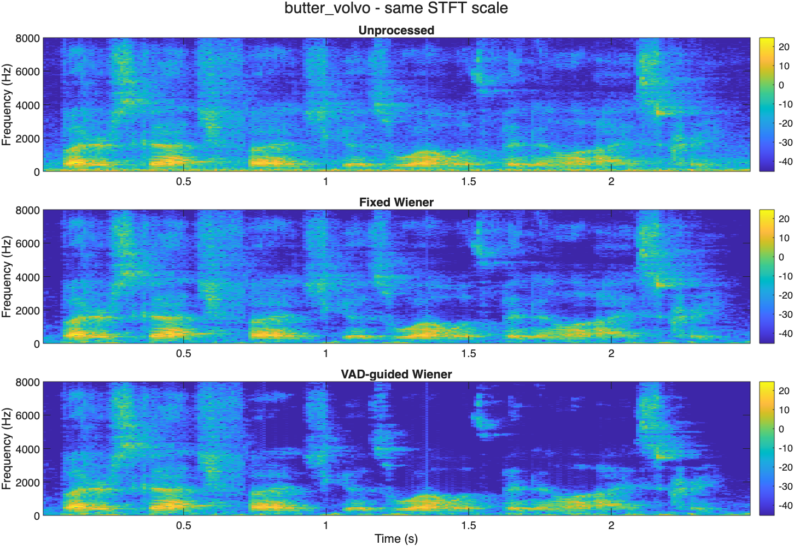

# Evaluation of VAD-Guided Wiener Filtering for Speech Enhancement Using Real Recordings in Everyday Noise

**Student:** Yulong Chen  
**SID:** 550889472  
**GitHub:** yche0441  
**Current milestone:** Project Feedback Two — first MATLAB pilot completed, 11 September 2026

## 1. Objective

Does updating a Wiener filter's noise estimate during likely non-speech frames improve enhancement compared with keeping that estimate fixed? This project tests the noise-update strategy while keeping the STFT, Wiener gain settings and reconstruction the same.

## 2. Work completed

A fixed-noise Wiener filter and an energy-VAD-guided alternative have been implemented and run on four cases in MATLAB Online R2026a Update 5. The run produced 12 rows of measurements, eight figures and twelve audio examples. All four identity reconstruction checks passed. The full [progress description](https://github.com/yche0441/elec5305-project-550889472/blob/main/Project_Feedback_Two/feedback_two_progress.md) explains the method, evidence and next steps.

## 3. Pilot data

Two SpEAR utterances, `butter` and `scholars`, are tested with factory and Volvo noise. The source describes speech and recorded noise played through separate speakers and recorded together by a microphone. Matching clean room recordings support evaluation. These are laboratory acoustic re-recordings, which differ from the student-recorded fan and traffic clips in the original proposal. The project code does not generate noise or digitally mix the signals.

Both filters receive the same short calibration pause selected using the aligned reference. This is an offline pilot with reference-assisted annotation. The [data and processing description](https://github.com/yche0441/elec5305-project-550889472/blob/main/Project_Feedback_Two/README.md) explains the sample lengths, calibration intervals and limitations.

## 4. Actual MATLAB results

Table 1. Reference SNR in dB. Values are rounded from the [MATLAB CSV](Project_Feedback_Two/results_matlab/metrics.csv).

| Recording | Unprocessed | Fixed Wiener | VAD-guided Wiener |
| --- | ---: | ---: | ---: |
| butter / factory | 2.99 | 7.84 | 6.99 |
| butter / volvo | 7.18 | 14.12 | 12.28 |
| scholars / factory | 9.98 | 14.90 | 13.99 |
| scholars / volvo | 13.75 | 19.96 | 19.50 |

Reference SNR uses the variance ratio between the matching room reference and the output-minus-reference error. Both filters improved this metric for all four inputs. The fixed baseline was higher than the VAD-guided result in every case. The current pilot therefore does not demonstrate an advantage for VAD-guided updating.

Figure 1. The butter/Volvo spectrograms use identical colour limits within the comparison. The scale is log STFT magnitude in dB on the original digital recording scale, not sound pressure level. Reduced spectral energy may include both noise reduction and speech loss.

### Audio examples

The examples below are actual MATLAB exports. A common playback gain is used across methods within each case. No formal listening-quality assessment has been completed.

| Case | Unprocessed | Fixed Wiener | VAD-guided Wiener |
| --- | --- | --- | --- |
| butter / factory | [Listen / download](Project_Feedback_Two/results_matlab/listening/butter_factory_original.wav) | [Listen / download](Project_Feedback_Two/results_matlab/listening/butter_factory_fixed.wav) | [Listen / download](Project_Feedback_Two/results_matlab/listening/butter_factory_vad.wav) |
| butter / volvo | [Listen / download](Project_Feedback_Two/results_matlab/listening/butter_volvo_original.wav) | [Listen / download](Project_Feedback_Two/results_matlab/listening/butter_volvo_fixed.wav) | [Listen / download](Project_Feedback_Two/results_matlab/listening/butter_volvo_vad.wav) |
| scholars / factory | [Listen / download](Project_Feedback_Two/results_matlab/listening/scholars_factory_original.wav) | [Listen / download](Project_Feedback_Two/results_matlab/listening/scholars_factory_fixed.wav) | [Listen / download](Project_Feedback_Two/results_matlab/listening/scholars_factory_vad.wav) |
| scholars / volvo | [Listen / download](Project_Feedback_Two/results_matlab/listening/scholars_volvo_original.wav) | [Listen / download](Project_Feedback_Two/results_matlab/listening/scholars_volvo_fixed.wav) | [Listen / download](Project_Feedback_Two/results_matlab/listening/scholars_volvo_vad.wav) |

## 5. Interpretation and next work

The next step is to inspect whether quiet speech is being included in the adaptive noise estimate. That is a possible explanation for the lower reference SNR, and it has not yet been established. The project will then test one documented modification and add further utterances using an evaluation procedure fixed before tuning.

This pilot contains only two utterances and two recorded noise sources. Non-speech evaluation intervals outside calibration are approximately 0.071-0.196 seconds long, and their labels are automatic reference-energy proxies. The results describe this small offline test and do not establish perceptual quality or general performance in everyday environments.

## 6. Code and evidence

- [Repository](https://github.com/yche0441/elec5305-project-550889472)
- [Run instructions and method](https://github.com/yche0441/elec5305-project-550889472/blob/main/Project_Feedback_Two/README.md)
- [Main MATLAB script](Project_Feedback_Two/run_project_feedback2.m)
- [MATLAB completion record](Project_Feedback_Two/results_matlab/RUN_COMPLETED.txt)
- [Dataset summary](Project_Feedback_Two/results_matlab/dataset_summary.csv)
- [All original MATLAB outputs as a ZIP](Project_Feedback_Two/Project_Feedback_Two_MATLAB_Results.zip)
- [All eight figures](https://github.com/yche0441/elec5305-project-550889472/tree/main/Project_Feedback_Two/results_matlab/figures)
- [Original proposal](ELEC5305_Project_Proposal_Yulong_Chen.pdf)

To reproduce the pilot, download the repository, open `Project_Feedback_Two` in MATLAB and run `run_project_feedback2.m`. The input recordings and helper functions are included.

## 7. Source acknowledgement

E. Wan, A. Nelson and R. Peterson, *Speech Enhancement Assessment Resource (SpEAR) Database*, Beta Release v1.0, CSLU, Oregon Graduate Institute of Science and Technology. The original [source README](https://github.com/yche0441/elec5305-project-550889472/blob/main/Project_Feedback_Two/source_information/README.md) and [technical description](https://github.com/yche0441/elec5305-project-550889472/blob/main/Project_Feedback_Two/source_information/details.md) are retained. Background research references remain in the original proposal.
