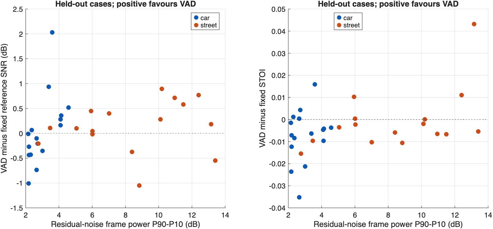

# Project Feedback Two: NOIZEUS results and interpretation

Yulong Chen · SID 550889472 · ELEC5305 · 13 September 2026

## 1. Objective

The research question is: **When does VAD-guided noise updating improve Wiener speech enhancement compared with a fixed initial noise estimate, and how does this depend on the time variation of the background noise?**

The first controlled experiment completed in MATLAB R2026a Update 5. It processed 48 clean/noisy input pairs and produced 144 rows of native SNR and STOI measurements. The result-collection correction `2026-09-13-r1` was used. Both the algorithm verification gates and the result-table regression check passed. The complete original run is preserved in the [MATLAB result archive](../evidence/NOIZEUS_Results_20260913_120452.zip).

## 2. Work completed

An existing implementation by LIU Ming / Pascal Scalart was reproduced before the controlled experiment. Its TSNR branch was adapted for the project. The two modes use a common analysis window, FFT, hop, SNR estimator, Wiener gain, initial PSD and reconstruction. Fixed mode keeps the initial noise PSD. VAD mode updates it recursively following non-speech decisions. The clean reference does not enter either enhancer.

The earlier proposal used independent environmental speech recordings. Following the teacher's feedback, NOIZEUS paired clean/noisy recordings now support the main quantitative test. The recordings are the corpus's prepared mixtures of speech and recorded real-world noise. They are not described as the student's own simultaneous recordings. A small selection of car and street conditions keeps the first experiment manageable. The [short literature review](../source_information/LITERATURE_REVIEW.md) connects eight papers to the design, including the existing TSNR implementation, VAD, noise tracking and intelligibility evaluation.

## 3. Dataset and evaluation

Six sentences were selected: sp01, sp06, sp11, sp16, sp21 and sp26. Each has car and street versions at nominal 0, 5, 10 and 15 dB. The files are unchanged 8 kHz mono PCM recordings. Two sentences, sp01 and sp16, form the 16-case development set. The other four sentences form the 32-case evaluation set, with four sentences per noise/SNR condition. The two sets have different speaker IDs in the corpus. The split and parameters were frozen before enhancement preflight.

Both modes estimate the initial noise PSD from the first 0.10 s. A reference check found low clean energy there, with a worst selected clean-to-residual energy ratio of -19.71 dB. It is an approximate noise-only interval with possible weak contamination. Both modes share this limitation.

Reference SNR and STOI use samples after the first 0.10 s. SNR compares the enhanced waveform with its corresponding clean signal, so remaining noise and speech distortion both contribute to error. The programme does not fit output gain or delay to the reference. Nominal corpus SNR and measured reference SNR are reported separately. Definitions, proxy labels and playback scaling are in the [metric guide](../METRIC_GUIDE.md).

## 4. Main results

The following values are arithmetic means over the **evaluation set only**, with 16 cases per noise type and method. These include four sentences at each of the four nominal SNRs. No significance test is claimed.

| Noise | Method | Mean reference SNR (dB) | Mean SNR gain over input (dB) | Mean STOI |
| --- | --- | ---: | ---: | ---: |
| Car | Unprocessed | 7.103 | +0.000 | 0.7959 |
| Car | Fixed TSNR Wiener | 10.814 | +3.711 | 0.7964 |
| Car | VAD-updated TSNR Wiener | 10.863 | +3.760 | 0.7891 |
| Street | Unprocessed | 7.207 | +0.000 | 0.8234 |
| Street | Fixed TSNR Wiener | 9.656 | +2.449 | 0.8029 |
| Street | VAD-updated TSNR Wiener | 9.800 | +2.593 | 0.8021 |

Both methods increased mean reference SNR over the unprocessed input. VAD updating produced an additional mean gain of only 0.049 dB for car noise and 0.144 dB for street noise over fixed estimation. Mean STOI decreased by 0.0073 and 0.0008, respectively. The fixed method's car STOI was close to the unprocessed value, while both street-noise methods had lower mean STOI than the input. These results show that lower waveform error did not consistently translate into higher predicted intelligibility.

| Noise | Cases | Mean VAD minus fixed SNR (dB) | Mean VAD minus fixed STOI | Higher SNR | Higher STOI | Both higher |
| --- | ---: | ---: | ---: | ---: | ---: | ---: |
| Car | 16 | +0.049 | -0.0073 | 7/16 | 4/16 | 1/16 |
| Street | 16 | +0.144 | -0.0008 | 11/16 | 5/16 | 5/16 |

VAD improved SNR in 18 of 32 evaluation cases and STOI in 9 of 32. Only 6 cases improved both measures relative to fixed estimation. All remaining cases are retained in the tables. The comparison therefore does not support a general claim that VAD updating is superior.

## 5. Dependence on noise and input SNR

Each row below averages four evaluation sentences. Positive values favour VAD updating.

| Noise | Nominal input SNR (dB) | Mean VAD minus fixed SNR (dB) | Mean VAD minus fixed STOI |
| --- | ---: | ---: | ---: |
| Car | 0 | -0.282 | -0.0055 |
| Car | 5 | -0.161 | -0.0177 |
| Car | 10 | +0.731 | +0.0004 |
| Car | 15 | -0.090 | -0.0063 |
| Street | 0 | -0.036 | +0.0102 |
| Street | 5 | +0.213 | -0.0063 |
| Street | 10 | +0.287 | -0.0002 |
| Street | 15 | +0.112 | -0.0070 |

The mean SNR difference was positive for car at nominal 10 dB and street at 5, 10 and 15 dB. The STOI differences followed a different pattern. In particular, car at 10 dB had a 0.731 dB mean SNR advantage but a near-zero mean STOI difference. Street at 0 dB had a positive mean STOI difference despite a slightly negative mean SNR difference.

The evaluated street residual noise had a larger mean frame-power spread than car noise, 8.45 versus 3.02 dB using the P90-P10 descriptor. The scatter plots show mixed positive and negative effects across these spreads. The small set does not establish a monotonic relationship between noise variation and enhancement benefit. Sentence characteristics, initial noise estimation and VAD decisions also vary.

For an individual positive example, sp06/car/10 dB gained 2.027 dB SNR and 0.0160 STOI relative to fixed estimation. Its STOI still remained below the unprocessed input, so this is a relative improvement over the fixed method. In a negative example, sp11/street/0 dB lost 1.054 dB SNR and 0.0106 STOI relative to fixed estimation. These examples were identified after the run to illustrate the range and do not replace the complete comparison.

## 6. VAD diagnostics and limitations

Clean-energy activity proxies provide a limited way to inspect decisions. Frames at or above -30 dB relative to the recording's peak clean-frame power are speech-energy proxies. Frames at or below -40 dB are non-speech-energy proxies. The middle band is unlabelled. These are not manual speech annotations, and they can miss quiet speech sounds.

In the evaluation set, VAD updating used 661 of 3076 speech-proxy frames for car and 664 of 3076 for street, approximately 21.5% and 21.6%. These pooled frame counts show that updates sometimes overlap with reference speech energy. The teacher identified speech entering the noise estimate as a potential failure mechanism. The observed overlap is consistent with that concern, but it does not by itself prove the cause of every STOI decrease.

The preselected sp06/car/5 dB example updated on 23 of 166 speech-proxy frames. The street example updated on 42 of 166. Their diagnostic plots reveal intervals where a non-speech decision overlaps with clean energy. These intervals should be checked during listening. The [car VAD plot](../results/run_20260913_120452/figures/sp06_car_5dB_vad.png) and [street VAD plot](../results/run_20260913_120452/figures/sp06_street_5dB_vad.png) are unchanged MATLAB exports.

All five exported figures were visually checked. The spectrogram comparisons share a colour scale within each clean/input/fixed/VAD group. The eight listening WAVs were checked against the saved signals, within their PCM quantization, but no subjective listener rating has been collected. Listening conclusions are therefore still pending.

Other limits are the four evaluation sentences, short recordings, one initial-noise interval and one fixed set of VAD parameters. The nominal SNR files can contain different noise excerpts, so comparisons across SNR levels are not a pure rescaling experiment. The original source's independent output peak normalization was replaced by a shared reconstruction rule in both modes; that adaptation and the complete [frozen protocol](../PROTOCOL.md) remain documented.

## 7. Verification and next work

An independent review read the saved waveforms and reproduced all reported reference SNRs, with a maximum difference below 6e-14 dB. It also checked corpus sample equality, noise-update traces, proxy counts, paired differences and condition means. STOI was checked as a completed native MATLAB measurement with finite scores and consistent aggregation; it was not independently recomputed in a second STOI implementation. The [review record](CHECKED_RESULTS.json) separates these checks.

The next step is to listen to the two preselected comparisons and annotate clear speech/non-speech intervals. A small threshold and hangover sensitivity study should use development data first. If parameters are selected after seeing these evaluation outcomes, a further test should use previously unused sentences and keep this v1 result visible. Longer noise changes and optional real-environment recordings can then test whether the findings extend beyond these short corpus examples.

This is a completed first quantitative experiment and a progress report. It does not establish an optimal detector or finish the final semester report and demonstration.
