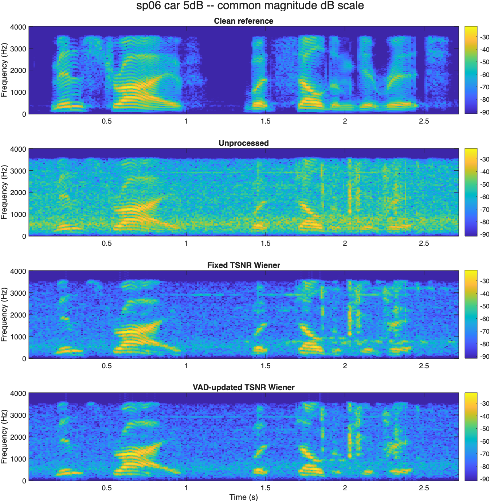
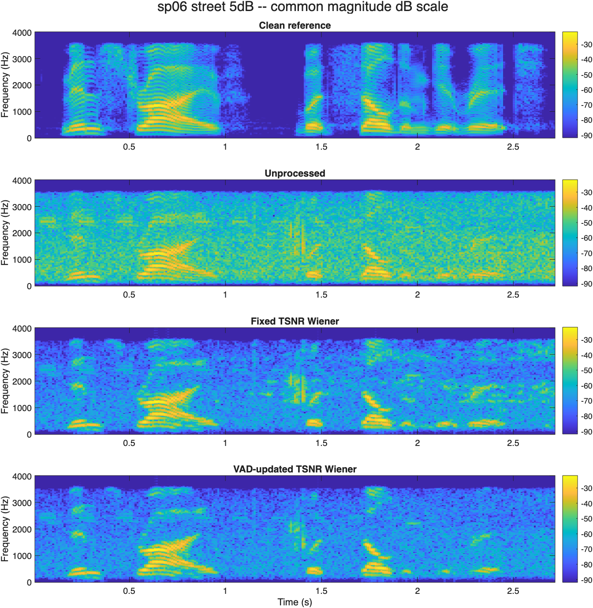

# Wiener speech enhancement with VAD-guided noise updating

**Yulong Chen · SID 550889472 · ELEC5305**

[GitHub repository](https://github.com/yche0441/elec5305-project-550889472) · [Detailed progress report](https://github.com/yche0441/elec5305-project-550889472/blob/main/Project_Feedback_Two_NOIZEUS/review/RESULTS.md)

## Project Feedback Two

This project asks when VAD-guided noise updating improves Wiener speech enhancement compared with a fixed initial estimate, and how the outcome relates to changing background noise. Following supervisor feedback, the main experiment uses paired NOIZEUS speech instead of separate quiet and noisy utterances. An existing implementation was reproduced first, and its TSNR branch now provides the shared processing path.

The first native MATLAB experiment completed on **13 September 2026**. All 48 inputs and 144 SNR/STOI rows completed, including the verification checks. The main results below use the 32-case evaluation set: four sentences, two noise types and four nominal input SNR levels. Development uses two different sentences/speakers.

## What the first experiment found

| Noise | Method | Mean reference SNR (dB) | Mean SNR gain over input (dB) | Mean STOI |
| --- | --- | ---: | ---: | ---: |
| Car | Unprocessed | 7.103 | +0.000 | 0.7959 |
| Car | Fixed TSNR Wiener | 10.814 | +3.711 | 0.7964 |
| Car | VAD-updated TSNR Wiener | 10.863 | +3.760 | 0.7891 |
| Street | Unprocessed | 7.207 | +0.000 | 0.8234 |
| Street | Fixed TSNR Wiener | 9.656 | +2.449 | 0.8029 |
| Street | VAD-updated TSNR Wiener | 9.800 | +2.593 | 0.8021 |

VAD updating had a small average SNR advantage over fixed estimation, but its average STOI was lower. Only 6 of 32 evaluation cases improved both measures. This is a mixed result. Noise tracking and preservation of speech need to be considered together.

The scatter plots show the VAD-minus-fixed difference for every evaluation case. Positive values favour VAD for that measure. These short recordings and four evaluation sentences do not establish a general or monotonic benefit from adaptation.

## Listen and inspect

The following sp06 examples at nominal 5 dB were selected before the run. Each quartet uses the same playback gain. Spectrogram colour limits are common within each quartet. No subjective listener scores have yet been collected.

### Car noise, nominal 5 dB

Clean reference: [download WAV](Project_Feedback_Two_NOIZEUS/results/run_20260913_120452/listening/sp06_car_5dB_clean.wav)

<audio controls preload="none" src="Project_Feedback_Two_NOIZEUS/results/run_20260913_120452/listening/sp06_car_5dB_clean.wav">Your browser can download the WAV using the link above.</audio>

Unprocessed: [download WAV](Project_Feedback_Two_NOIZEUS/results/run_20260913_120452/listening/sp06_car_5dB_unprocessed.wav)

<audio controls preload="none" src="Project_Feedback_Two_NOIZEUS/results/run_20260913_120452/listening/sp06_car_5dB_unprocessed.wav">Your browser can download the WAV using the link above.</audio>

Fixed TSNR Wiener: [download WAV](Project_Feedback_Two_NOIZEUS/results/run_20260913_120452/listening/sp06_car_5dB_fixed.wav)

<audio controls preload="none" src="Project_Feedback_Two_NOIZEUS/results/run_20260913_120452/listening/sp06_car_5dB_fixed.wav">Your browser can download the WAV using the link above.</audio>

VAD-updated TSNR Wiener: [download WAV](Project_Feedback_Two_NOIZEUS/results/run_20260913_120452/listening/sp06_car_5dB_vad.wav)

<audio controls preload="none" src="Project_Feedback_Two_NOIZEUS/results/run_20260913_120452/listening/sp06_car_5dB_vad.wav">Your browser can download the WAV using the link above.</audio>

[VAD and reference-energy diagnostic plot](Project_Feedback_Two_NOIZEUS/results/run_20260913_120452/figures/sp06_car_5dB_vad.png)

### Street noise, nominal 5 dB

Clean reference: [download WAV](Project_Feedback_Two_NOIZEUS/results/run_20260913_120452/listening/sp06_street_5dB_clean.wav)

<audio controls preload="none" src="Project_Feedback_Two_NOIZEUS/results/run_20260913_120452/listening/sp06_street_5dB_clean.wav">Your browser can download the WAV using the link above.</audio>

Unprocessed: [download WAV](Project_Feedback_Two_NOIZEUS/results/run_20260913_120452/listening/sp06_street_5dB_unprocessed.wav)

<audio controls preload="none" src="Project_Feedback_Two_NOIZEUS/results/run_20260913_120452/listening/sp06_street_5dB_unprocessed.wav">Your browser can download the WAV using the link above.</audio>

Fixed TSNR Wiener: [download WAV](Project_Feedback_Two_NOIZEUS/results/run_20260913_120452/listening/sp06_street_5dB_fixed.wav)

<audio controls preload="none" src="Project_Feedback_Two_NOIZEUS/results/run_20260913_120452/listening/sp06_street_5dB_fixed.wav">Your browser can download the WAV using the link above.</audio>

VAD-updated TSNR Wiener: [download WAV](Project_Feedback_Two_NOIZEUS/results/run_20260913_120452/listening/sp06_street_5dB_vad.wav)

<audio controls preload="none" src="Project_Feedback_Two_NOIZEUS/results/run_20260913_120452/listening/sp06_street_5dB_vad.wav">Your browser can download the WAV using the link above.</audio>

[VAD and reference-energy diagnostic plot](Project_Feedback_Two_NOIZEUS/results/run_20260913_120452/figures/sp06_street_5dB_vad.png)

## What needs improvement

About 21.5% of the pooled car speech-energy-proxy frames and 21.6% of the street frames were used for noise updates. These reference-energy proxies are not manual speech labels. Their overlap with updates identifies cases to inspect for speech entering the noise estimate. It is a possible contributor to the mixed STOI results, not a proven explanation of every case.

Next steps are listening review, VAD error annotation and a small parameter study on development data. Any later parameter selection will be documented and tested on previously unused material where possible.

## Code, data and evidence

- [Working code and instructions](https://github.com/yche0441/elec5305-project-550889472/tree/main/Project_Feedback_Two_NOIZEUS).
- [Original native MATLAB results ZIP](Project_Feedback_Two_NOIZEUS/evidence/NOIZEUS_Results_20260913_120452.zip), including all signals.
- [Per-case metrics](Project_Feedback_Two_NOIZEUS/results/run_20260913_120452/metrics.csv) and [paired comparisons](Project_Feedback_Two_NOIZEUS/results/run_20260913_120452/paired_comparisons.csv).
- [Run status](Project_Feedback_Two_NOIZEUS/results/run_20260913_120452/RUN_STATUS.txt) and [independent review record](Project_Feedback_Two_NOIZEUS/review/CHECKED_RESULTS.json).
- [Eight-paper short literature review](https://github.com/yche0441/elec5305-project-550889472/blob/main/Project_Feedback_Two_NOIZEUS/source_information/LITERATURE_REVIEW.md), [protocol](https://github.com/yche0441/elec5305-project-550889472/blob/main/Project_Feedback_Two_NOIZEUS/PROTOCOL.md) and [metric definitions](https://github.com/yche0441/elec5305-project-550889472/blob/main/Project_Feedback_Two_NOIZEUS/METRIC_GUIDE.md).

The existing source is credited to LIU Ming / Pascal Scalart, and the corpus to NOIZEUS / Hu and Loizou. [Source details and references](https://github.com/yche0441/elec5305-project-550889472/blob/main/Project_Feedback_Two_NOIZEUS/source_information/SOURCE_AND_CHANGES.md). The original proposal records the initial plan; this progress page describes the revised experiment. The final report and video remain future deliverables.

